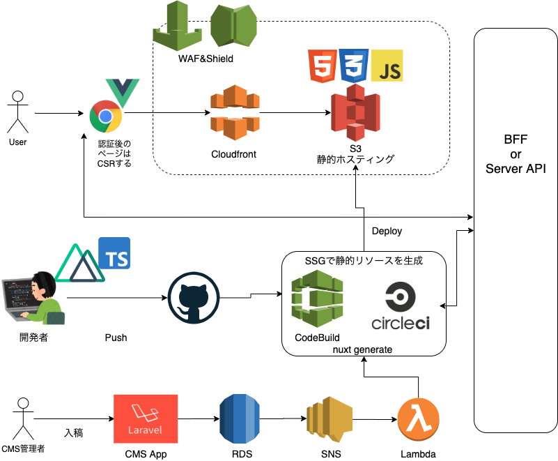

# SEO for JS -フロントアーキテクチャ-

はてナースアプリのフロントアーキテクチャを考えるにあたり、SEOの観点で技術検証をした結果をまとめる。

# 構成図

## 採用技術スタック-アプリ編-

### Vue.js

フロントエンドの開発で採用されるライブラリ・フレームワークとしては、Vue.js, React.js, Angular.jsが選択肢にあがる。今回のようにSPA構成を組む場合はVue.jsかReact.jsの二択になる。検討ポイントを以下に記す。

- 既存プロダクトでVue.jsを採用しており、開発者の学習コストが最も低い
- 以前まではVue.jsとTypeScriptの相性が悪い（型推論の精度が悪い）と言われていたが、Vue3の登場によって解消された（nuxtのようなフレームワークでもVue3対応を進めており、それまではライブラリでVue3の書き方を踏襲できる）
- SFCで記載することで、今までのHTML, CSS, JSの単位で分離して管理でき、見通しがよい
    - デザイナーと協力する場合も修正箇所がわかりやすい
    - ⇔React.jsはrender関数の中で書くHTML(jsx)がデザイナーにはわかりにくい可能性が高い。CSS in JSも書き方はあまり変わらないが、VueのSFCには劣る。

以上の理由からVue.jsを採用としたい。

### TypeScript

プロダクトの特性として、UIテストや単体テストを厳密に書くのはROIが小さい。一方で、熟練の開発者だけのチームでは無いので当然ミスも発生する。人の入れ替わりも頻繁に発生するので、不具合を検知できるものが仕組みとしてほしい。型をつけて実装していくことで、不具合発生を抑制するとともに、開発体験を向上させることができる。また、今やフロントエンドを書くにあたってTSを使うことはメインストリームとなっており、採用の際にも優位に働くと判断。

※TSで書くことによってテストコードが無くて良いということではない

### Nuxt.js

Vue.jsを使用しつつ、SSRやSSGをしたい際は、現状Nuxt.js以外の選択肢が無い。SPAとして開発する際もルーティングやミドルウェアの設定が楽になるのでSSRさせなくてもNuxt.jsを使用しているケースもよく見る。Vue3対応が完了していないので、開発・運用しながらNuxt.js V3のアナウンスを待つことになるが、それまでは[@nuxtjs/composition-api](https://github.com/nuxt-community/composition-api) を使用することで、Vue3の書き方を踏襲することができる。

**Composition-API**

- [Nuxt公式サイト](https://composition-api.nuxtjs.org/)
- これまでと違い、関数のように書くので共通の処理を使いまわしやすくなった
- わかりにくい概念であったthisを使用しなくなった
- [CompositionAPI含むVue3で変わったことについて](https://speakerdeck.com/kazupon/mamonakuyatutekuru-vue-dot-js-3)
- [Nuxt2.12.0で新しくなったfetchについて](https://qiita.com/miyaoka/items/11fdc03ff591d34a585c)
- [Nuxt.js with TypeScript and Composition API](https://qiita.com/Aruneko/items/552fcd3ae5da4eb1b218)
- これまでAPIサーバーからデータをFetchして初期データをレンダリングする際はasyncDataが使われていたが、CompositionAPIでは[useFetch](https://composition-api.nuxtjs.org/helpers/usefetch/)が使われる。好きなタイミングで初期レンダリングのみならず、好きなタイミングでfetchできる。さらに、処理中のステータスやエラーハンドリングも簡単にできる。

    

### ここまでの整理

- Vue.js
- Nuxt.js
- TypeScript
- CompositionAPI

を使用。これから触れるSSG, SSR, DR(SPA)どれを選択するとしても、上記の採用技術が変わることは無いと思われる。（仮にSPAだとしてもNuxtを採用して開発したほうが楽なので。）一方で、ページの生成方法・レンダリング手法については検討の余地はあるので変更はあるかもしれない。

## How JavaScript works with bot

SPAを構築するにあたり、課題としてあげられるのがSEO対策である。

- GoogleBotがJSを実行しない可能性がある
- OGPなどが適切に表示されない可能性がある

といった懸念がある。

しかし、[Google公式サイト](https://developers.google.com/search/docs/guides/javascript-seo-basics)を参照する限り、GooglebotはJSを実行した上でインデックスすると述べられている。以下に処理の流れを示す。

GooglebotがJSを処理する仕組み([https://developers.google.com/search/docs/guides/javascript-seo-basics](https://developers.google.com/search/docs/guides/javascript-seo-basics))

図の通り、GooglebotがJSを処理する際は

- クロール→HTML取得
    - followリンクがある場合→クロールキューにエンキュー→クロール
    - JSがある場合→レンダーキューにエンキュー→レンダリング→HTMLをIndexing

となる。

### Why is JS for SEO difficult?

**レンダーキュー**

JSを含むリソースの場合は、ファーストウェーブでHTMLが処理されたあとに、レンダーキューにエンキューされる。botのリソースの空きができ次第、デキューを行いJSを実行して最終的なHTMLを出力する(=セカンドウェーブ)。

つまり、JSを実行しないと言うのは誤りで、Googlebotはキューを扱いつつJSを処理する。注意すべきはデキューのタイミングである。ここに関しては、数分から数時間までの幅が予想され、実際にどれくらいでレンダリングされのか明確になっていない。fetch as Googleでカバーして運用できるのであれば問題視しなくてもよいが、できるだけ早くIndexされたい場合（UGCがメインとなるサイトなど）は、セカンドウェーブに乗らないようにファーストウェーブのみでIndexingされるようにページを生成するべきとなる。ただし、[セカンドウェーブの処理をファーストウェーブと統合しようとする動き](https://www.youtube.com/watch?v=YP2tMBhyU0I)もあるので、レンダーキューのIndex遅延問題は時間が解決してくれるはず。

**タイムアウト**

また、JSを実行してくれるとは言っても、時間がかかる処理をいつまでも待ってくれるわけでは無いようだ。botのリソースを逼迫するような処理に関しては必ずしもJSが実行された上でHTMLがIndexingされるわけではないということに注意されたい。参考データとしては、およそ5秒ほどで処理が終わっていれば問題はなさそうである。([参照](https://medium.com/@l.mugnaini/spa-and-seo-is-googlebot-able-to-render-a-single-page-application-1f74e706ab11))

**OGPなどのmetaタグ**

最後に、OGPの設定値(metaタグ)に関して。例えばFacebookやTwitterのようなSNSでリンクを張ったときに、SNSのbotはいちいちJSを実行してくれない。したがって、metaタグに関しては最初からレンダリングされていないといけない。

**Googlebot以外のbot**

GooglebotはJSを実行すると明言しているが、他のbotがどこまで実行してくれるのかは定かではない。SEOを重視するサイトであるのであれば、念のためにSEO対策を講じたほうがよいと思われる。

### So, what should we do?

それらの問題を解決するための手段はいくつかある。

1. Server Side Rendering
2. Static Site Generator
3. Dynamic Rendering

**SSR(Server Side Rendering)**

従来の方法。サーバーでJSを実行してレンダリング済のHTMLをクライアントに返すやり方。

参照：[スモールスタートではじめるSSR](https://tech.dely.jp/entry/min_ssr)

Pros

- セカンドウェーブに流れないのでIndexの遅延の影響を受けない
- UGCや認証後のページなどをIndexさせることができる
- UGCをはじめとする更新の頻度が高いページでもIndexさせることができる
- CSRに比べて初期ロードが早い(FCP, FIDなどのスコア向上に寄与する)

Cons

- サーバーの管理が増えるので運用の手間が増す。コストもかさむ。
- FWが限られる
- ビルド、デプロイが面倒
- 構成が複雑になる
- SSRといってもJSが思いとレンダリングされないこともある
    - 参照：[Rails+ReactなSPAサイトでSEOをしようとしてぶつかった壁](https://developers.o-uccino.com/entry/2018/10/10/103522)

**SSG(Static Site Generator)**

ビルド時にデータをフェッチしてbotがアクセスできるHTMLすべてを生成して、静的ホスティングで公開する手法。

Pros

- 初回ロードが高速でありながらルーティングなどはCSRでやるので動作が高速
- 公開する際にサーバーが不要

Cons

- 毎回ビルドしないと最新のデータを反映できない
- 認証後のページなどは事前にJS実行できない
    - UGCには向いてない
    - 生成時にクローリングできないページはHTMLの大枠だけ生成されて、残りのJSはCSRされる。
        - SEOを意識したいページとそうでないページで事前に生成するかどうかを決める必要がある。

**DR(Dynamic Rendering)**

ユーザーエージェントでそのアクセスがbotなのかユーザーなのかを判断し、botの場合はJS実行済のHTMLを渡すやり方。ユーザーにはSPAの状態で渡すのでCSRとなる。

補足：DRはクローキングにならないのか？

ブラックハットSEOの手法として、クローキングがある。これは、botとユーザーとで表示させるページを意図的に変えてしまう手段である。例えばbotには日用品のECとしてみせつつ、実際のユーザーが見るページはアダルトサイトが表示されているとか。クローキングが発覚するとペナルティを課される。では今回のDRは、そのクローキングとみなされないのか？結論からすると、botに見せているページとユーザーに見せているページで大きな差異がなければクローキングとはみなされない。[Google公式サイト](https://developers.google.com/search/docs/guides/dynamic-rendering)でもDRを推奨していることからも、安心して取り入れる事ができるといえるだろう。

Pros

- すでにSPAを導入している場合は、追加の対応が最小限で済む
- キャッシュを利用することでbotに対して高速にHTMLを返すことができる
- セカンドウェーブに流されないですむ
- 公開用のサーバーがいらない

Cons

- prerenderingサービスが必要（Lambdaあたりが候補になりそう）
    - マシンパワーが必要なため、インフラ構成によっては料金が心配
- ユーザーに見せるページの初回ロードが遅い（ただのCSRであるので）
    - FCP, FDIなどが下がる可能性が大きい
- 一時的な対応となりがち
    - google側がアップデートを掛けて、セカンドウェーブがなくなったり、タイムアウトが伸びたりして、開発側でSEO対策を徹底する必要がなくなったときにDRは不要となる。それであれば、初回ロードを高速にできる手段をとったほうが長期的に価値が出るのではないかという考えもある。

rendertronハンズオンにピッタリの記事：[rendertronを用いてSSRに対応してないサイトでもSEOやOGP対策を行う](https://blog.hiroppy.me/entry/rendertron)

### Which should I choose?

**結論**

**SSGを採用**

NuxtでSSG機能をもちいて静的リソースを生成し、ホスティングするやり方を採用したい。

理由は下記。

- 今回のサイト(HN)にはUGCが使われることはない。←回答者が限られた人しかできない＋回答に時間がかかるのでQだけサイトに載せるわけにもいかないし、Aをユーザーに応えさせるわけにもいかない。（ナス女やきらッコノートも同様かも）
- 認証機能をつけるが、認証が必要なページをSEOする必要は無い。
- インフラに強いメンバー集まっているわけではないので、フロント側のリソース管理のためにサーバーを追加して管理するのが大変(現状の求人媒体の運用で精一杯)なのでSSRは避けたほうが無難。
- すでにSPAを導入しているわけではないので、DR導入の際の少コストの旨味が少ない。それであれば、今後のメインストリームとなりそうなSSGを採用したほうが、対外的なアピールにもなる（採用に良い影響）

今後UGCがメインとなるとか、JS Render Queueの遅延(=Index遅延)がきになるとか、逐次ビルドが面倒とかの要素がでてきたらそのままDRに移行することも視野に入れても良い。そもそもが静的ホスティングの構成であればSSG→DRの移行も比較的簡単である。また、必要に応じて、部分的にDR・SSGを導入することも可能なので共存することも可能。ゼロに帰することは無いと判断してSSGをメインで進めるとした。

## 技術スタック後半-インフラ編-

### CloudFront＋S3

既存でAWSを使用しているので外部サービスを導入するよりも、AWS鉄板の構成を使用する。

CloudFrontにより高速なレスポンスが可能。

### WAF+Shield

主にDDos対策に使用。WAFはL7のハンドリングが可能なので、画面のURL単位でアクセスを管理することが可能。ShieldはL4の対策が可能。どちらも組み合わせて使う。

### **Code Build, CircleCI**

Githubとインテグレーションをし、アプリソースコードの更新がかかったときに自動でビルド＆デプロイする仕組みを構築する。スクリプトの中で`nuxt generate`を実行し、静的リソースを生成し、S3に配置する。その際、BFFや公開されているServerAPIを通じてデータをFetchできるようにネットワーク経路を構築する必要がある。

### RDS＋SNS＋Lambda

CMSの入稿画面から新しい記事を入稿した際、逐次ビルドする必要がある。そのため、RDSの更新をトリガーにして、SNSを介してLambdaをキックし、`nuxt generate`を実行する。このフローによって入稿者は何も意識することなく最新の記事がデプロイされていてかつSEO対策もされた状態で公開されることになる。もし入稿のタイミングが固定されているのであれば、ビルド定期実行スクリプトを1日の中で何回か動かす、というやり方でも対応可能。入稿時間が不定期でかつすぐに反映してほしいという場合は、イベント駆動で自動化するのが望ましい。
参照：[RDSイベント通知の使用](https://docs.aws.amazon.com/ja_jp/AmazonRDS/latest/UserGuide/USER_Events.html#USER_Events.Subscribing)